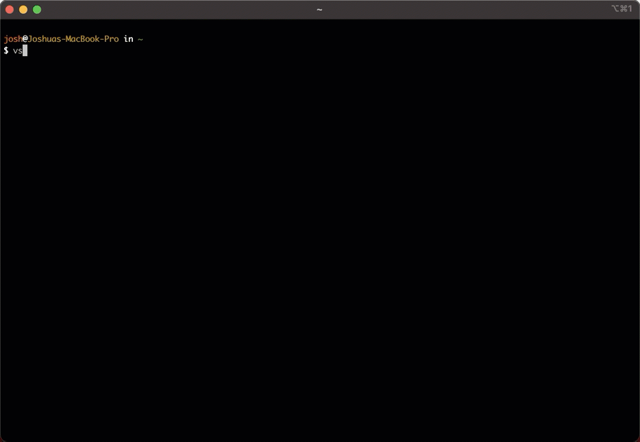

# vaultssh

<p align="center">
    <a href="https://crates.io/crates/vaultssh">
        
    </a>
    <a href="https://www.vaultproject.io/">
        
    </a>
    <a href="https://github.com/jmgilman/vaultssh/actions/workflows/ci.yml">
        
    </a>
</p>

> A small CLI wrapper for authenticating with SSH keys from [Hashicorp Vault][1]

vaultssh is a small CLI wrapper for automatically fetching and using signed SSH 
certificates when remoting into a host. It wraps the ssh process and is 
therefore compatible with all standard ssh flags.

## Installation

```
cargo install vaultssh
```

Or install using `brew`:

```
brew tap jmgilman/homebrew-apps
brew install vaultssh
```

## Usage



```
$> vssh --help

vaultssh 0.1.0

A small CLI wrapper for authenticating with SSH keys from Hashicorp Vault

USAGE:
    vssh [FLAGS] [OPTIONS] <HOST> [ARGS]...

ARGS:
    <HOST>       ssh host
    <ARGS>...    additional arguments to pass to ssh

FLAGS:
    -b, --basic      disables terminal effects
    -h, --help       Print help information
    -p, --persist    persist acquired tokens to ~/.vault-token
    -V, --version    Print version information

OPTIONS:
    -a, --auth-method <AUTH>         default authentication method to use
        --auth-mount <AUTH_MOUNT>    default authentication mount to use
    -c, --config <CONFIG>            config file (default: $HOME/.vssh)
    -i, --identity <IDENTITY>        ssh key-pair to sign and use (default: $HOME/.ssh/id_rsa)
    -m, --mount <MOUNT>              mount path for ssh backend (default: ssh)
    -r, --role <ROLE>                vault role account to sign with (default: "default")
    -s, --server <SERVER>            address of vault server (default: $VAULT_ADDR)
    -t, --token <TOKEN>              vault token to use for authentication (default: $VAULT_TOKEN)
```

## Configuration

A configuration can be used by either creating it at `~/.vssh` or passing one in
using the CLI option. Configuration files are in TOML format. An example one is
shown below:

```toml
# Example config - place this in ~/.vssh to automatically use it
#
# The authentication names are the same as the default mount point for the 
# associated engine. For example, "approle" for AppRole and "oidc" for OIDC. 
# Not all engines are supported, only the ones shown below. You don't have to
# configure each one and may only configure the one you set to the default. 

auth = "oidc"                  # default authentication method to use
auth_mount = "oidc"            # default mount point for the authentication method
identity = "~/.ssh/id_rsa"     # ssh key-pair to sign and use
mount = "ssh"                  # mount path for ssh backend
persist = true                 # persist acquired tokens to ~/.vault-token
role = "myrole"                # vault role account to sign with
server = "https://vault:8200"  # address of vault server

[approle]                      # name of auth method to configure
role_id = "myrole"             # default values for auth method

[oidc]
role = "admin

[userpass]
username = "myuser"
```

## Flow

The following occurs when you run vssh:

* A valid SSH certificate is searched for using the passed identity name
* If no certificate is found, or the found certificate is expired, a new 
  certificate is requested
* A connection to Vault is initiated using any found tokens. If no token is
  found or the token is expired, a login prompt is given to acquire a new token.
* The public key for the passed identity is signed and the certificate is saved
  to the local filesystem
* The ssh program is executed and is passed the host and any additional
  arguments

## Authentication

By default, if a new certificate is needed but no valid token has been found
then vssh will initiate a login prompt for acquiring a new token. This token
will only be used for the single session unless the `--persist` option is given
in which case the token is saved to the Vault CLI's default location of 
`~/.vault-token`. Future uses of vssh will use this token. 

Not all authentication methods are currently supported, see the above
configuration example for the ones that are. Specifying defaults for the
authentication method will pre-fill the login prompt to make logging in easier.
However, all other auth methods are still available if desired (i.e. setting
defaults does not skip any prompts). 

## Contributing

Check out the [issues][2] for items neeeding attention or submit your own and 
then:

1. Fork it (https://github.com/jmgilman/vaultssh/fork)
2. Create your feature branch (git checkout -b feature/fooBar)
3. Commit your changes (git commit -am 'Add some fooBar')
4. Push to the branch (git push origin feature/fooBar)
5. Create a new Pull Request

[1]: https://www.vaultproject.io/
[2]: https://github.com/jmgilman/vaultssh/issues